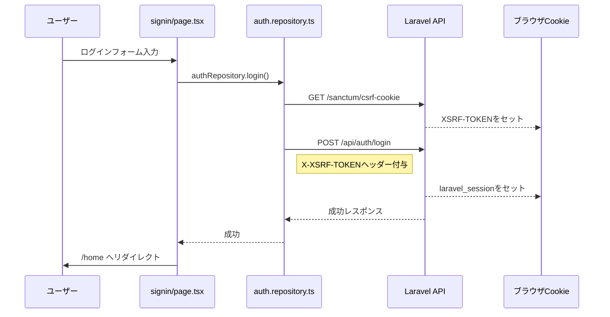
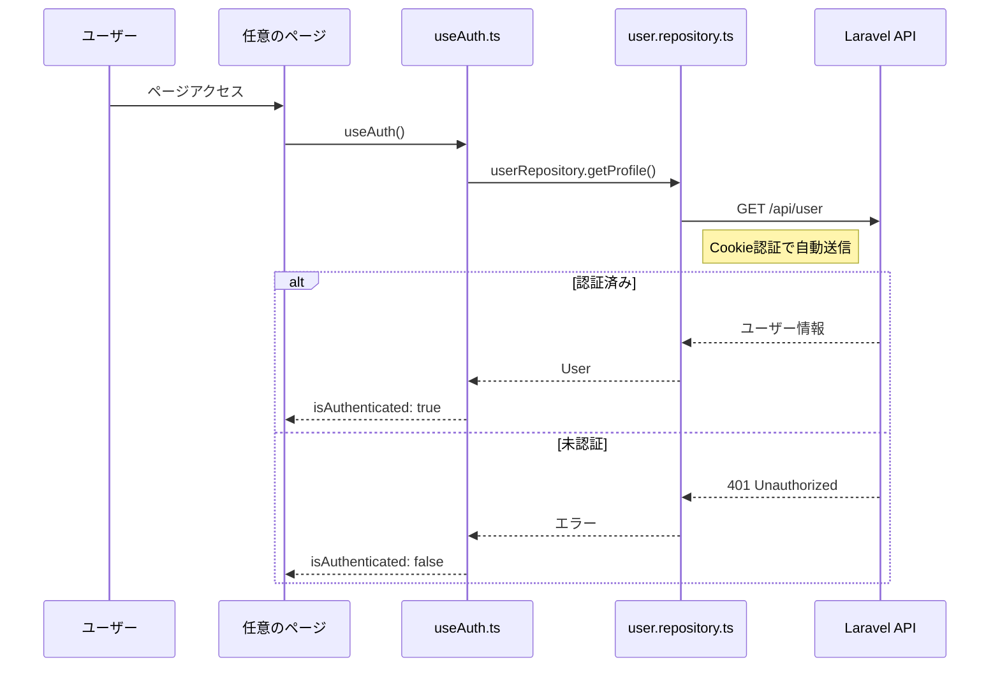
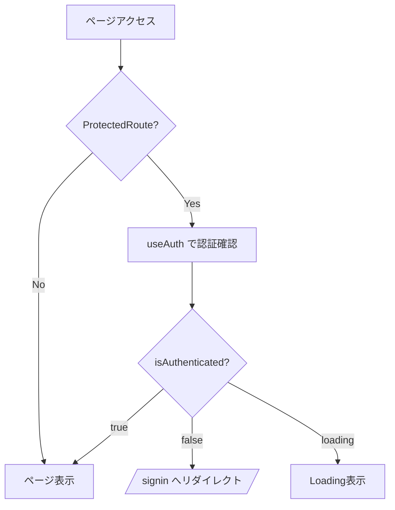
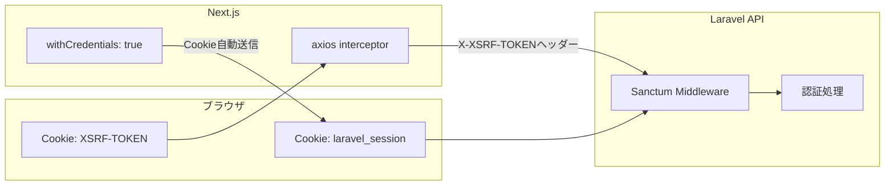

# 認証フロー

このプロジェクトはLaravel Sanctum（Cookie認証）を使用したSPA認証を実装しています。

## フロー図

## ファイル構成と役割

### `src/lib/auth.repository.ts`
認証APIとの通信を担当するリポジトリ

| 関数 | 説明 |
|------|------|
| `getCsrfCookie()` | `/sanctum/csrf-cookie`からCSRFトークンを取得 |
| `login(params)` | ログイン処理。内部で`getCsrfCookie()`を先に呼び出す |
| `logout()` | ログアウト処理 |
| `register(params)` | 新規ユーザー登録 |

axiosインターセプターでリクエスト時に`XSRF-TOKEN`Cookieを読み取り、`X-XSRF-TOKEN`ヘッダーに自動付与。

### `src/hooks/useAuth.ts`
認証状態を管理するカスタムフック

| 戻り値 | 説明 |
|--------|------|
| `isAuthenticated` | 認証状態（`true`/`false`/`null`） |
| `user` | 認証済みユーザー情報 |
| `loading` | 認証確認中フラグ |
| `logout()` | ログアウト処理を実行し`/signin`へリダイレクト |
| `profileImageUrl` | プロフィール画像URL |

マウント時に`userRepository.getProfile()`でプロフィール取得を試み、成功すれば認証済みと判定。

### `src/lib/user.repository.ts`
ユーザー情報APIとの通信を担当

| 関数 | 説明 |
|------|------|
| `getProfile()` | `/api/user`から認証済みユーザー情報を取得 |

`auth.repository.ts`と同様に、axiosインターセプターで`X-XSRF-TOKEN`ヘッダーを自動付与。

### `src/components/ProtectedRoute.tsx`
認証が必要なページをラップするコンポーネント

- `useAuth()`で認証状態を確認
- `isAuthenticated === false` の場合、`/signin`へリダイレクト
- `loading`中は`Loading...`を表示

### `src/app/signin/page.tsx`
ログインページ

- `authRepository.login()`を呼び出し
- 成功時は`/home`へリダイレクト
- 失敗時はアラート表示

### `src/app/signup/page.tsx`
新規登録ページ

- `authRepository.register()`を呼び出し
- 成功時は`/signin`へリダイレクト
- 失敗時はアラート表示

### `src/components/Header.tsx`
ヘッダーコンポーネント

- `useAuth()`で認証状態を取得
- `isAuthenticated`に応じてログイン/プロフィールメニューを切り替え
- ログアウト処理は`useAuth().logout()`を使用

## 認証の仕組み（Laravel Sanctum）

- `withCredentials: true`でCookieを自動送信
- `XSRF-TOKEN`Cookieの値を`X-XSRF-TOKEN`ヘッダーにセット
- Laravel側でCSRFトークンとセッションを検証

