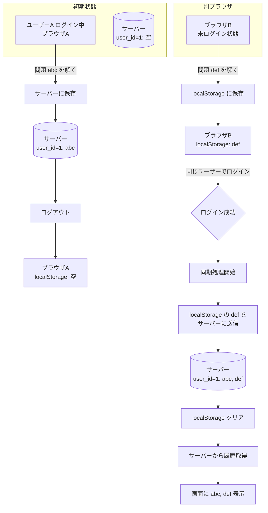
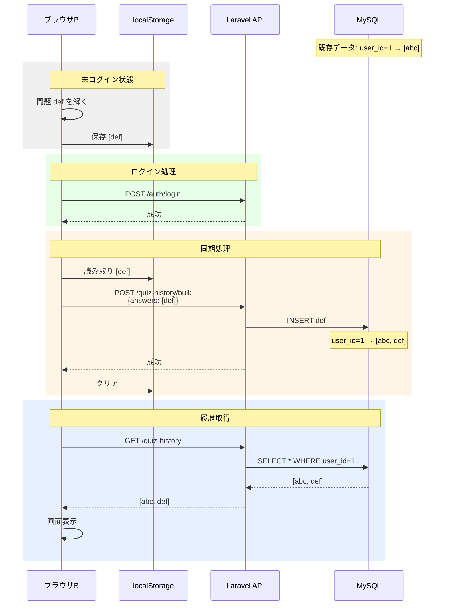
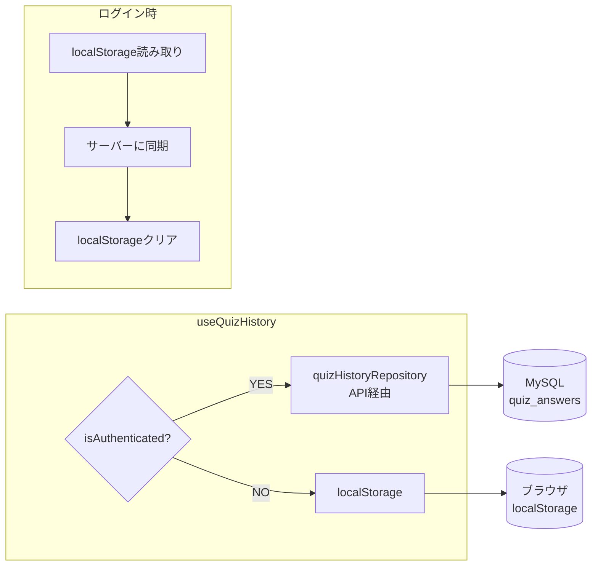
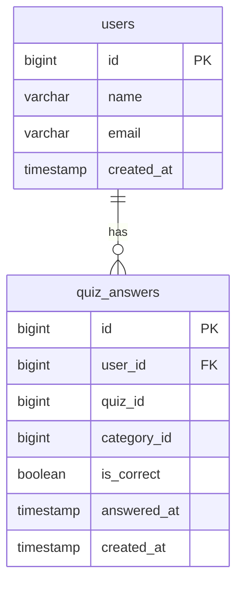

```mermaid
flowchart TD
    subgraph 初期状態
        A[ユーザーA ログイン中<br/>ブラウザA]
        B[(サーバー<br/>user_id=1: 空)]
    end

    A -->|問題 abc を解く| C[サーバーに保存]
    C --> D[(サーバー<br/>user_id=1: abc)]

    D --> E[ログアウト]
    E --> F[ブラウザA<br/>localStorage: 空]

    subgraph 別ブラウザ
        G[ブラウザB<br/>未ログイン状態]
    end

    G -->|問題 def を解く| H[localStorage に保存]
    H --> I[ブラウザB<br/>localStorage: def]

    I -->|同じユーザーでログイン| J{ログイン成功}

    J --> K[同期処理開始]
    K --> L[localStorage の def を<br/>サーバーに送信]
    L --> M[(サーバー<br/>user_id=1: abc, def)]
    M --> N[localStorage クリア]
    N --> O[サーバーから履歴取得]
    O --> P[画面に abc, def 表示]
```

```mermaid
sequenceDiagram
    participant B as ブラウザB
    participant LS as localStorage
    participant API as Laravel API
    participant DB as MySQL

    Note over DB: 既存データ: user_id=1 → [abc]

    rect rgb(240, 240, 240)
        Note over B,LS: 未ログイン状態
        B->>B: 問題 def を解く
        B->>LS: 保存 [def]
    end

    rect rgb(230, 255, 230)
        Note over B,API: ログイン処理
        B->>API: POST /auth/login
        API-->>B: 成功
    end

    rect rgb(255, 245, 230)
        Note over B,DB: 同期処理
        B->>LS: 読み取り [def]
        B->>API: POST /quiz-history/bulk<br/>{answers: [def]}
        API->>DB: INSERT def
        Note over DB: user_id=1 → [abc, def]
        API-->>B: 成功
        B->>LS: クリア
    end

    rect rgb(230, 240, 255)
        Note over B,DB: 履歴取得
        B->>API: GET /quiz-history
        API->>DB: SELECT * WHERE user_id=1
        DB-->>API: [abc, def]
        API-->>B: [abc, def]
        B->>B: 画面表示
    end
```

```mermaid
flowchart LR
    subgraph useQuizHistory
        A{isAuthenticated?}
        A -->|YES| B[quizHistoryRepository<br/>API経由]
        A -->|NO| C[localStorage]
    end

    B --> D[(MySQL<br/>quiz_answers)]
    C --> E[(ブラウザ<br/>localStorage)]

    subgraph ログイン時
        F[localStorage読み取り] --> G[サーバーに同期] --> H[localStorageクリア]
    end
```

```mermaid
erDiagram
    users ||--o{ quiz_answers : has
    users {
        bigint id PK
        varchar name
        varchar email
        timestamp created_at
    }
    quiz_answers {
        bigint id PK
        bigint user_id FK
        bigint quiz_id
        bigint category_id
        boolean is_correct
        timestamp answered_at
        timestamp created_at
    }
```

